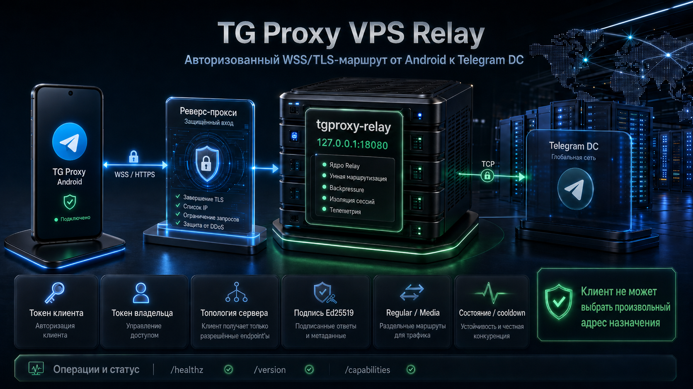

# TG Proxy VPS Relay

<p align="center">
  <strong>Авторизованный WebSocket/TLS-маршрут от TG Proxy Android к Telegram DC</strong><br>
  Linux · regular/media topology · owner tokens · автоматическая настройка из приложения
</p>

<p align="center">
  <a href="https://github.com/Dushnyj/TG-Proxy-Relay/releases/latest"></a>
  &nbsp;
  <a href="docs/VPS_REQUIREMENTS.md#linux-и-архитектуры"></a>
</p>



Relay — серверная часть [TG Proxy Android](https://github.com/Dushnyj/TG-Proxy). Она принимает
только авторизованный WebSocket, выбирает endpoint из server-owned Telegram topology и открывает
TCP-соединение к нужному production/test DC. Client не может передать произвольный destination.

## Для пользователя Android

Ручная работа с Linux не требуется:

1. Подготовьте VPS по [коротким требованиям](docs/VPS_REQUIREMENTS.md).
2. В TG Proxy откройте **Настройки → Relay → Автонастройка VPS**.
3. Введите SSH IP/host, port, login и password, выданные хостингом.
4. Подтвердите SSH fingerprint.
5. Выберите публичный IP, бесплатный DuckDNS или свой домен/поддомен.
6. Проверьте read-only план и нажмите установку.

Android сам определяет Linux/architecture/package manager/init, скачивает правильный asset,
создаёт backup, устанавливает service и HTTPS, проверяет regular/media маршруты и сохраняет
owner-доступ локально. Домен покупать не нужно.

- [Требования к VPS](docs/VPS_REQUIREMENTS.md)
- [Что делает Android-мастер](docs/ANDROID_AUTO_SETUP.md)
- [Пошаговая Android-инструкция](https://github.com/Dushnyj/TG-Proxy/blob/main/docs/VPS_RELAY.md)
- [Бесплатный DuckDNS](https://github.com/Dushnyj/TG-Proxy/blob/main/docs/DUCKDNS.md)
- [Ссылка, QR и импорт](https://github.com/Dushnyj/TG-Proxy/blob/main/docs/SHARING_AND_IMPORT.md)

## Архитектура

```text
Telegram Android
  -> TG Proxy local MTProto 127.0.0.1:1443
  -> wss://relay.example.com/apiws?dc=2&media=0&test=0
  -> reverse proxy
  -> tgproxy-relay 127.0.0.1:18080
  -> bounded race of server-owned Telegram endpoints
  -> TCP Telegram DC
```

Публичный prefix обычно предоставляет:

```text
WS   /apiws?dc=<dc>&media=<0|1>&test=<0|1>
GET  /apiws/healthz
GET  /apiws/version
GET  /apiws/capabilities
POST /apiws/test-routes
GET  /apiws/connect
...  /apiws/admin/v1/*
```

Client endpoints используют `Authorization: Bearer <client-token>`. Owner API принимает только
отдельный owner-token; один raw secret нельзя использовать в обеих ролях.

## Надёжность Telegram и media

- несколько IPv4/IPv6 endpoints на DC;
- отдельные regular/media/CDN pools и произвольные ports;
- endpoint health, exponential cooldown, half-open probe и bounded race;
- WebSocket ping/pong, limits и корректные close codes;
- server-side `/test-routes` с честной маркировкой `TCP_ONLY`;
- настоящий MTProto proof выполняет Android;
- Ed25519 signed topology, replay/downgrade/expiry checks и atomic last-known-good;
- strict query validation и запрет client-supplied destination.

## Токены и owner control plane

В конфигурации/state хранятся SHA-256 hashes, не raw tokens. Владелец через Android может:

- видеть client tokens и подключённые устройства;
- создать отдельный token и получить secret один раз;
- отозвать token и немедленно закрыть его sessions;
- отключить sessions одного устройства;
- заблокировать/разблокировать installation ID;
- увидеть модель, версии, first/last seen и приблизительные страну/город.

Relay 1.3.0 выдаёт стабильный `instanceId`, поэтому Android объединяет несколько client tokens
и публичных aliases одной установки, но не смешивает независимые VPS. Owner protocol 2 делает
создание токена идемпотентным: повтор после сетевого сбоя возвращает тот же secret вместо
дубликата.

`admin.geoIpUrl` можно оставить пустым, чтобы не обращаться к внешнему GeoIP provider.

Подробнее: [TOKENS.md](docs/TOKENS.md) и [API.md](docs/API.md).

## Релизные файлы

GitHub Actions собирает static Linux archives:

```text
amd64, 386, arm64, armv7, armv6, armv5,
riscv64, ppc64, ppc64le, s390x, loong64,
mips, mipsle, mips64, mips64le
```

Каждый архив содержит binary, README, LICENSE, `config.example.json`, docs и service template.
`SHA256SUMS.txt` публикуется рядом. Android-мастер автоматически выбирает architecture и
проверяет checksum/version до замены binary.

## Ручная установка

Для администратора, которому не нужен Android auto-setup:

1. [выберите VPS и откройте порты](docs/VPS_REQUIREMENTS.md);
2. [скачайте asset, создайте hashes и service](docs/INSTALL.md);
3. [настройте безопасный reverse proxy](docs/REVERSE_PROXY.md);
4. [проверьте и обновляйте сервер](docs/UPDATES.md).

Не публикуйте standalone HTTP в интернет. Production endpoint должен использовать HTTPS/WSS.

## Документация

- [Единый индекс](docs/README.md)
- [Требования к VPS](docs/VPS_REQUIREMENTS.md)
- [Автонастройка Android](docs/ANDROID_AUTO_SETUP.md)
- [Ручная установка](docs/INSTALL.md)
- [Reverse proxy](docs/REVERSE_PROXY.md)
- [API](docs/API.md)
- [Токены](docs/TOKENS.md)
- [Telegram topology и signing](docs/TOPOLOGY.md)
- [Обновления](docs/UPDATES.md)
- [Устранение проблем](docs/TROUBLESHOOTING.md)
- [Разработка](docs/DEVELOPMENT.md)
- [Релизы](docs/RELEASES.md)
- [Поддержка](SUPPORT.md)

## Разработка

```bash
test -z "$(gofmt -l .)"
go vet ./...
go test ./...
go build -trimpath -o tgproxy-relay ./cmd/tgproxy-relay
```

Официальный tag `v*` запускает release workflow и публикует все archives с checksums.

## Безопасность

Не публикуйте raw client/owner tokens, production hashes/config/state, SSH/TLS/signing keys и
частные endpoints. Закрытое сообщение: [SECURITY.md](SECURITY.md). Лицензия: [MIT](LICENSE).
